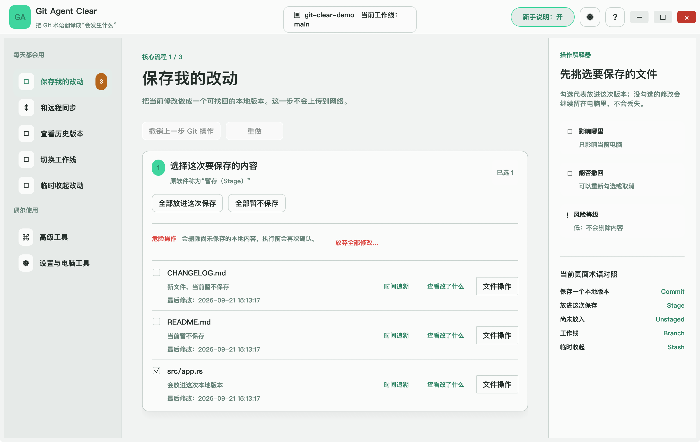
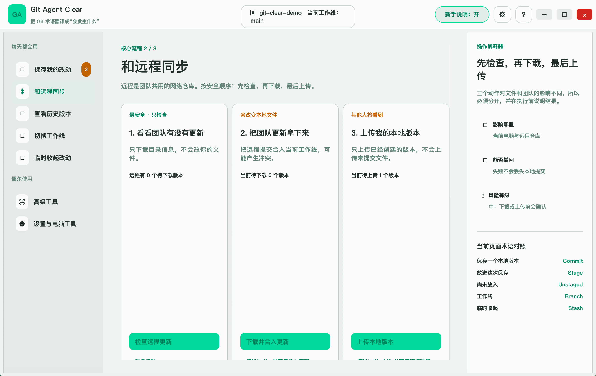
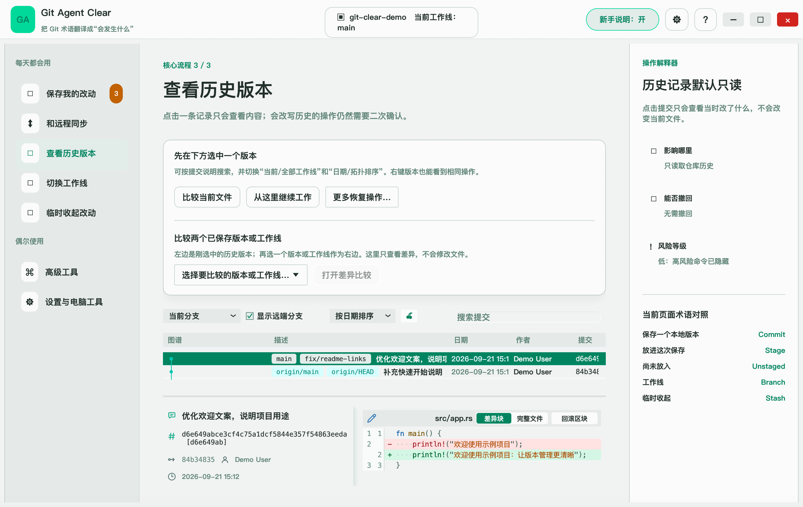

<!-- lang:zh-CN -->
# Git Agent Clear

Git Agent Clear 是一款引导式界面的桌面 Git 客户端，使用 Rust 和 egui 构建。它把日常和高级 Git 操作组织成清晰的任务页面——项目、保存改动、远程同步、历史版本、分支、临时收起、合并冲突与设置。核心操作会说明影响范围、能否撤回和风险等级，让不熟悉 Git 命令行细节的人也能更可靠地完成操作。

这是安装在电脑上运行的软件，不需要搭建网站或团队服务。你可以只在本机管理版本，也可以连接自己的 GitHub、GitLab 等远程仓库备份或协作。

[下载最新正式版](https://github.com/awiggy/git-clear-desktop/releases/latest) · [反馈问题](https://github.com/awiggy/git-clear-desktop/issues) · [功能对照记录](docs/original-vs-guided-functional-audit.md)

当前源码版本：**v1.2.2**。[查看更新说明](docs/releases/v1.2.2.md)。

## 应用预览

以下三张为 **v1.2.2 macOS 正式版的实际运行截图**，按“保存改动 → 远程同步 → 查看历史”的日常流程展示。截图使用专门创建的示例仓库，不包含真实用户项目或凭据；点击图片可查看原图。

### 1. 保存与检查改动

勾选需要放进本次版本的文件，查看差异与修改时间；右侧说明操作的影响范围和风险。



### 2. 和远程同步

将检查更新、下载并合入、上传本地版本分开呈现，并显示待同步数量与风险说明。个人仓库和团队仓库都适用；截图使用本机测试远程仓库。



### 3. 查看历史版本

浏览提交图谱、分支标记和版本说明，选中一条记录查看文件差异。普通浏览不改变当前文件；修改历史的操作另行确认。



## 主要能力

- 管理多个工作空间与仓库：打开、创建、克隆，多项目标签
- 保存改动：暂存、提交、差异查看、文件时间追溯；危险的丢弃操作会二次确认，并明确说明哪些内容无法恢复
- 远程同步：Fetch / Pull / Push，认证失败、无上游、分叉和冲突场景的分步引导
- 历史版本：提交图谱、搜索、比较、检出、回退、拣选与归档
- 分支与临时收起：本地/远程分支管理，Stash 完整流程
- 冲突与历史整理：三方冲突工具（含可选 AI 建议）、交互式变基
- 高级仓库能力：标签、补丁、Git LFS、Git Flow、子模块与子树、性能基准测试
- 设置与桌面工具：主题、字体、语言、SSH、提交身份、托管账号与可选 AI 模型

## 安装

使用前请先安装 [Git](https://git-scm.com/downloads)，并确认终端中执行 `git --version` 能正常返回版本号。Git Agent Clear 调用本机 Git 完成仓库操作，不会在安装包中重复捆绑 Git。

从 [Releases](https://github.com/awiggy/git-clear-desktop/releases) 下载对应平台的安装包：

- **macOS 11 或更高版本**：`GitAgent-Clear-<版本>-macOS.dmg`，同时支持 Apple Silicon 和 Intel；打开后将应用拖入“应用程序”文件夹
- **Windows x64**：`GitAgent-ClearSetup-<版本>.exe`，安装向导可选择安装路径
- **Linux x86_64**：`GitAgent-Clear_<版本>_amd64.deb`，适用于 Debian / Ubuntu

当前 macOS 安装包使用临时签名，尚未经过 Apple Developer ID 公证。首次打开时如果系统提示无法验证开发者，请在访达中右键应用并选择“打开”；仍被拦截时，可前往“系统设置 → 隐私与安全性”确认打开。请只从本仓库的 Releases 页面下载安装包。

安装后应用设置、项目列表和日志保存在以下位置；你打开的项目文件仍保存在原目录：

```text
Windows: <安装路径>\data
macOS:   ~/Library/Application Support/Git Agent Clear
Linux:   $XDG_DATA_HOME/git-agent-clear 或 ~/.local/share/git-agent-clear
```

通过本仓库 Releases 发布的正式安装包提供“检查更新”，更新来源只指向本仓库；直接执行 `cargo build` 得到的本地开发版本不会启用自更新。

## 第一次使用

1. 打开 **Git Agent Clear**，选择打开已有项目、新建本地项目，或输入远程仓库地址进行克隆。
2. 在“保存我的改动”中勾选文件、查看差异、填写说明，再创建本地版本。这一步不会自动上传。
3. 如果需要备份或协作，在“和远程同步”中配置远程地址，再检查更新、按需下载并合入、上传本地版本。个人仓库同样可以使用，不要求加入团队。
4. 在“查看历史版本”中浏览已保存的记录。切换工作线、临时收起改动以及高级工具可以按需使用。

“新手说明”开关仅控制解释栏，不切换另一套软件界面。主题、字体、字号和语言可在“设置与电脑工具”中调整。

## AI 与文件时间追溯

- 普通 Git 操作不需要模型 API Key。可选 AI 用于三方合并工具中的冲突处理建议；使用时需要自行配置模型服务、地址和凭据，并检查建议后再应用。连通测试也会请求所配置的服务。
- 使用模型建议时，相关代码内容会发送至你配置的模型服务；请先确认该服务适合处理这些内容。新增的候选收集与过滤方案进度见 [AI 合并计划](docs/merge-ai-auto-merge-plan.md)。
- 文件时间追溯显示本机创建/修改时间和已有 Git 提交记录。本机时间可能受复制或解压影响，不等于原始产出时间；Git 只能追溯已提交的版本，不能恢复每一次未提交的写入。
- 丢弃或删除未提交内容可能无法恢复。推送、重置、变基等操作请先阅读页面影响说明。

## 验证范围

最近一次本机自动化回归为 **675 项通过、0 失败、3 项外部 AI 测试忽略**。各正式版本的跨平台测试和打包结果可在 [Actions](https://github.com/awiggy/git-clear-desktop/actions/workflows/build.yml) 中核对。

v1.2.2 三个平台的测试与打包均已通过，正式下载附件已校验；具体测试数量、安装包信息与 SHA-256 见 [v1.2.2 发布核验记录](docs/releases/v1.2.2-verification.md)。

自动化测试和安装包构建通过，不等于已经逐项完成所有真实账号场景。SSH、GPG、托管账号、真实 AI 请求及应用内升级的实机待验收项目，记录在 [真实凭据验收清单](docs/clear-edition-live-acceptance.md) 中；Git LFS 等功能需要对应外部工具。

## 构建

需要 Rust stable、Cargo、Git，以及目标系统的图形界面开发依赖。Linux 的依赖安装方式可参考 [构建工作流](.github/workflows/build.yml)。

```bash
cargo test --locked                  # 运行测试
cargo build --release --locked       # 产出 Release 二进制，位于 target/release/
```

## 主题

通常直接使用应用里的外观设置即可。开发者也可以修改 `theme.json`：主题令牌使用 HSL 模板，`${c}` 会被替换为选中的强调色。应用依次查找 `GIT_AGENT_THEME` 指定文件、可执行文件旁的 `theme.json` 和当前工作目录的 `theme.json`，并使用内置默认值补足配置。

在所选配色文件旁创建 `theme.local.json` 可以只覆盖声明的键，其余继承。该文件已被 Git 忽略；修改配色文件后需重新启动应用。

## 发布

推送一个新的 `clear-v<版本>` 标签会自动运行测试、构建三个平台的安装包并发布 GitHub Release。标签版本必须与 `Cargo.toml` 一致，已经发布的标签不要重复使用。

```bash
# 示例：先更新 Cargo.toml / Cargo.lock，并添加 docs/releases/v1.2.3.md
git tag clear-v1.2.3
git push origin clear-v1.2.3
```

以此方式构建的安装包会启用应用内自更新，更新源为本仓库的 Release 流。发布前需在 `docs/releases/` 添加同版本的更新说明，流水线会将其用于 Release 正文，并附带 `SHA256SUMS.txt`。已有 Release 安装包不会被流水线覆盖。
